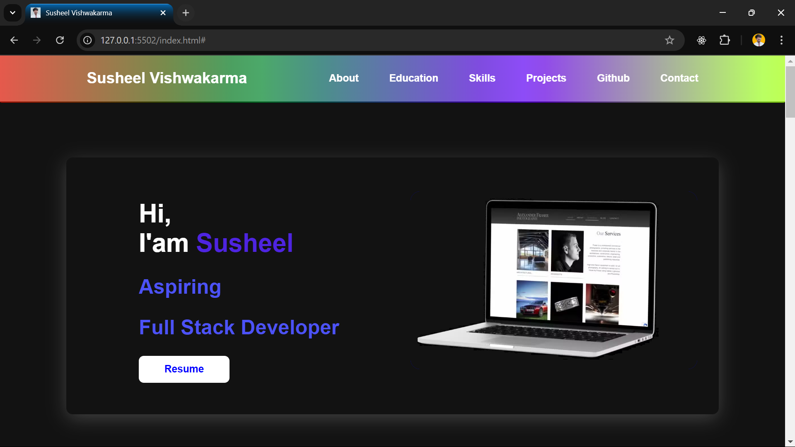
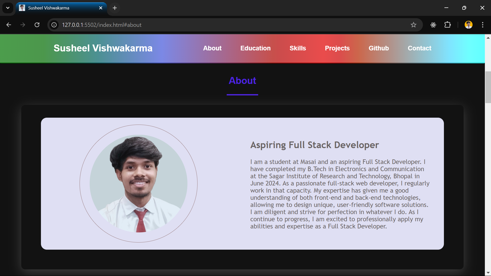
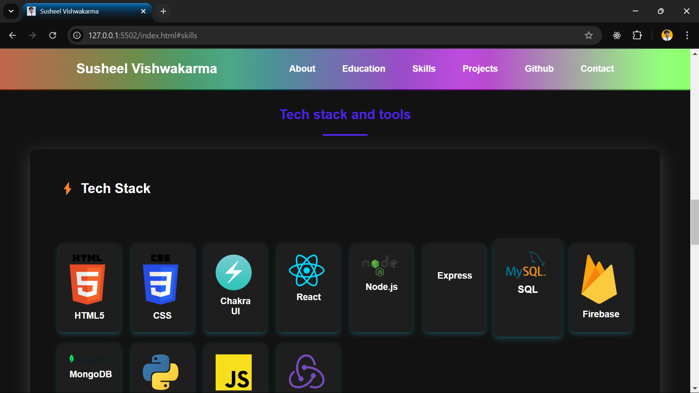
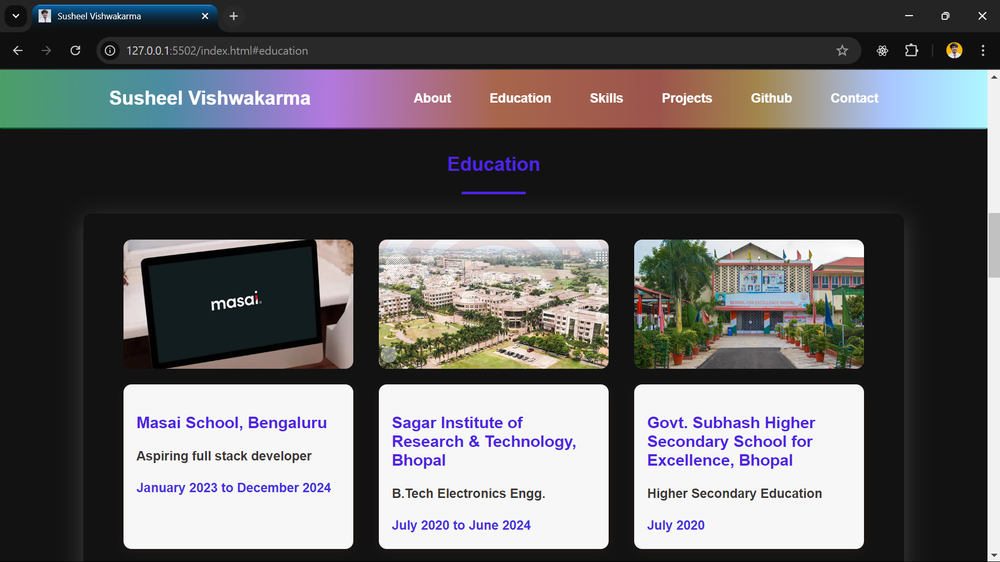
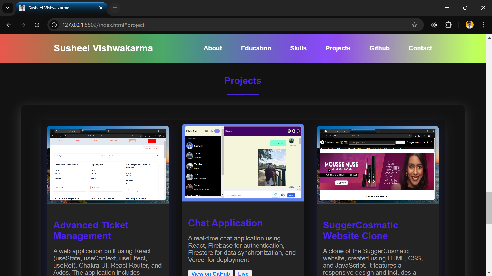
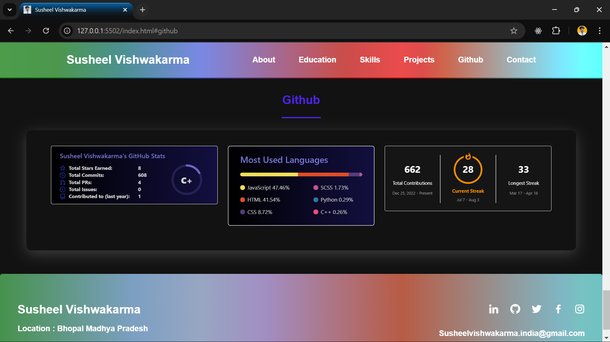

## Technologies Used

- HTML5
- SASS (CSS Preprocessor)
- CSS3
- JavaScript

## Features

- Responsive design
- Interactive navigation menu
- Sections for About, Skills, Tools, Education, Projects, and GitHub
- Contact information and social media links

## Sections

# Home

# About

# Skills and Tools

# Education

# Projects

# GitHub

[website link](https://susheelvishwa.netlify.app)

[github link](https://github.com/susheelvishwa/cap01_064-portfolio)
